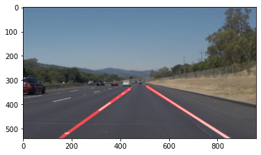

# **Finding Lane Lines on the Road** 

## Jonathan Thomas

## 1. Pipeline Design

### Colour Thresholding
The first step of the pipeline is to identify and select the yellow and white parts of the image since these are the lane line colours. A colour range was set for each colour to account for changes in lighting or weather conditions. A custom helper function was created to convert to hsv format, filter for pixels within the selected colour range and combine them into a single image.

### Grayscale Conversion
The second step takes the output from the first step and converts it to grayscale format since only 1 channel is needed to perfom the required computer vision techniques.

### Gaussian Smoothing
The third step is to apply a gaussian filter to the image to remove high frequency detail in order to improve results later on in the pipeline. Through testing, a kernel size of 11 was discovered to yield the best results.

### Canny Edge Detection
The fourth step is to run the image through the Canny edge detection algorithm to highlight all sharp edges. The best high and low Canny thesholds were found to be 100 and 50 respectively.

### Region of Interest Selection
The fifth step is to limit features to only a portion of the image to remove any unwanted edges such as those present in the horizon. A trapezoid shapped region of interest was used to preserve only the lane lines.

### Line Segment Detection
The sixth step uses openCV's hough line detector to create line segments from the previously detected edges. The resulting image has multiple line segments since a single lane line yields multiple edges hence multiple line segments so further processing is still needed.

### Line Segment Classification and Fitting
The seventh and final step of the pipeline is to fit a single smooth line along the left and right lane lines, this was done within the draw_lines() function. The lines segments were classified as right/left lane by averaging the x-values of each line to check what half of the screen the midpoint is on. This method was chosen instead of using the lines orientation/slope since a curving road might result in both lane lines orienting the same way. A single line was then fitted for both the left and right lane using a ransac regressor to reject any outliers cased by lighting, debris or paint spot spots on the road. The final output can be seen below.

## 2. Potential Shortcomings

One shortcoming I identified was that the yellow lane lines were picked up better than the white ones. This could occur because the white lane markings have less contrast with the road or because an rgb colour scheme was used when thresholding for white. Another possible shortcoming is the hardcoded region of interest, while it may work on the test cases of this assignment it may not hold true in other conditions as the region of interest would move if the car is turning or going up/down a hill.

## 3. Possible Improvements 

A possible solution for the white lane markings could be to switch to a hsv scheme since it is more robust to lighting or to impove the threshold values by picking colours present in test footage. A possiible solution for the region of interest could be to dynamically change it by seperating the road from the horizon using classical computer vision techniques.
